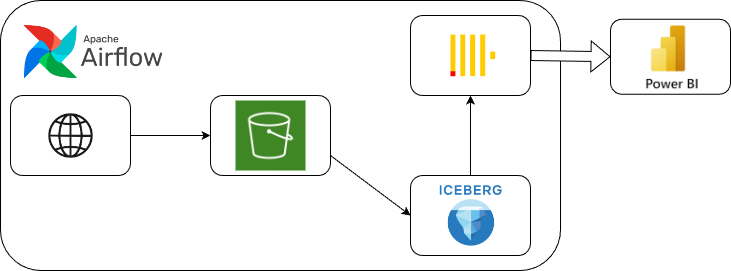

# Graduation Project

This graduation project 

## Repository rules

| Branch   | Description                         |
|----------|-------------------------------------|
| feature/ | Branch for new features, DAGs, etc. |
| master/  | Current DAGs, prod. environment     |
| fix/     | Branch for quick-fixes              |

1. `master/` branch **is under protection**
2. Nothing can be pushed in `master/` until it completes GitHub Actions pipeline

## Data Infrastructure

The project implements a **Data Lakehouse** architecture for storing and managing data in **AWS S3** using **Apache Iceberg**.
Processed data is later loaded into **ClickHouse** for analytics — the data model design for ClickHouse is currently being evaluated.

