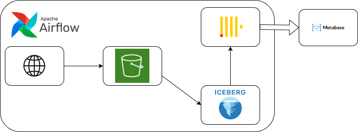

# Graduation Project

Graduation project for building a MOEX-based **Data Lakehouse** in **AWS S3** with Airflow DAG orchestration.

## Repository rules

| Branch   | Description                          |
|----------|--------------------------------------|
| feature/ | Branch for new features, DAGs, etc. |
| master/  | Current DAGs, prod. environment      |
| fix/     | Branch for quick-fixes               |

1. `master/` branch **is under protection**.
2. Nothing can be pushed in `master/` until it completes GitHub Actions pipeline.

## Data Infrastructure

Current scope: ingest only **raw** data snapshots from MOEX ISS API into S3.

## Configuration

Set via environment variables or Airflow Variables:

- `AWS_BUCKET`
- `AWS_ACCESS_KEY`
- `AWS_SECRET_KEY`
- `AWS_REGION` (optional, default: `eu-central-1`)
- `URL_SECURITIES` (optional override)
- `URL_ENGINES` (optional override)
- `TOKEN` (optional, Telegram bot token)
- `CHAT_ID` (optional, Telegram chat id)

Use `config.template` as a base.

## Additional MOEX endpoint DAGs

Implemented as separate DAG files in `dags/moex/`:

- `dag_dim_reference_index.py` (`moex_dim_reference_index`) ->
  `/iss/index.json` for global dictionaries (`dim_engine`, `dim_market`,
  `dim_board`).
- `dag_dim_security_full.py` (`moex_dim_security_full`) ->
  `/iss/securities.json` for `dim_security`.
- `dag_bridge_tqbr_securities.py` (`moex_bridge_tqbr_securities`) ->
  `/iss/engines/stock/markets/shares/boards/TQBR/securities.json`
  for `bridge_security_board` and current tradable instruments.
- `dag_fact_history_daily.py` (`moex_fact_history_daily`) ->
  `/iss/history/engines/stock/markets/shares/securities.json?date=YYYY-MM-DD`
  and `/iss/history/engines/stock/markets/bonds/securities.json?date=YYYY-MM-DD`
  for `fact_stock_daily` and `fact_bond_daily`.
- `dag_fact_candles_daily.py` (`moex_fact_candles_daily`) ->
  `/iss/engines/stock/markets/shares/boards/TQBR/securities/{SECID}/candles.json`
  with `from/till/interval=24` for `fact_security_candles`.

All datasets are stored as raw snapshots into `raw/moex/...` with `date`/`dt`
partitions only.
